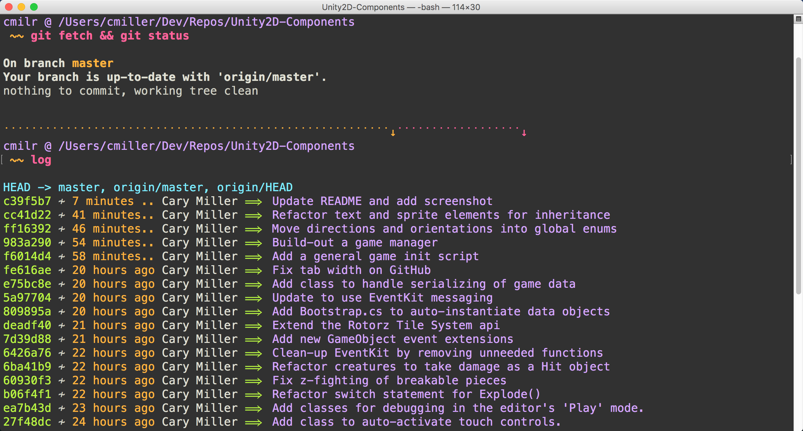

[![GitHub release][version-badge]][releases]&nbsp;
[![Platform][mac-badge]][repo]&nbsp;
[![GitHub issues][issues-badge]][issues]&nbsp;
[![GitHub license][license-badge]][license]&nbsp;
[![Code of Conduct][coc-badge]][coc]&nbsp;

# Git Beautifier For MacOS & OS X Terminal

Transform your command line from ugly and painful to delightful and easy-to-read.



## Setup
First things first, you'll want to install a nice color theme for your terminal. The one in the screenshot above is called Monokai Soda Custom, and you'll find it included in the repo. I based it off of the most excellent Monokai Soda theme, [found here](https://github.com/lysyi3m/osx-terminal-themes).

Load the theme by opening up your mac terminal and navigating to **Preferences > Profiles > Import**, and then set the theme as your default.

Now log into your bash terminal and punch in the following git config commands. You should be able to copy & paste them as a full block and just hit return. This tells git that we want color in our UI, and sets specific colors for specific file status types.

```sh
git config --global color.ui true
git config --global color.status.changed "blue normal"
git config --global color.status.untracked "red normal"
git config --global color.status.added "magenta normal"
git config --global color.status.updated "green normal"
git config --global color.status.branch "yellow normal bold"
git config --global color.status.header "white normal bold"
```
Now you'll need to update your .bash_profile with the contents of the bash_profile included in the repo. The easiest way to do this will be to first *show all hidden files* on your system, because .bash_profile is usually set to invisible. You can show hidden files by pasting the following command into your terminal.

```sh
defaults write com.apple.finder AppleShowAllFiles YES; killall Finder /System/Library/CoreServices/Finder.app
```
Once your finder reloads, you should be able to see all hidden files. In the finder, navigate to **Users/YourUserNameHere**, and you should see .bash_profile listed in the directory. If you don't, you simply have to create one yourself (just place an empty text file there and name it .bash_profile.)

Either way, open your .bash_profile and paste in the contents of the bash_profile included in this repo (paste it beneath any other content that's already in there.) Now save the file.

**Congratulations!** Your .bash_profile now includes all the code that your terminal needs to display it's UI in color, including a nicely colorized bash -ls command, a customized command prompt, and aliases for a number of highly-readable git log formats. You can customize these to your heart's content, but hopefully this will give you a solid jumping-off point.

Now let's hide those invisible files again, by pasting the following command into the terminal and hitting return.

```sh
defaults write com.apple.finder AppleShowAllFiles NO; killall Finder /System/Library/CoreServices/Finder.app
```
Restart the terminal app, and you're ready to go!

## Usage

With any luck, you should now have a nice looking command line terminal running on your Mac. If you like, point the terminal to one of your git repositories and take a few of the included git log aliases for a ride.

```sh
log
```
Type in 'log' and hit return, and you should get a nicely formatted basic log, starting with a list of refs on top, followed by all your commits.

Now explore the other colorized aliases if you like:
- 'log' displays a basic git log with single-line commit messages only (this is the one I use most often.)
- 'logv' displays a more verbose log, including email addresses for commit authors.
- 'logg' displays an ascii graph of your branches, along with basic log info.
- 'loggv' displays an ascii graph of your branches, along with more verbose log info.
- 'logm' displays multi-line commit messages.
- 'refs' displays your repo's refs and abbreviated hashes.
- 'remotes' display your repo's remotes and remote branches.

Lastly, type in the trusty '-ls' bash command and you should see a nicely colorized list of files, directories, etc.

Well, that's it. You're good to go!

## Questions? Drop Us a Line!

### Contact
- Email: cary.a.miller@gmail.com
- Twitter: [@cmillerco](https://twitter.com/cmillerco)
- GitHub: [cmilr](https://github.com/cmilr/)

### License
Distributed under the MIT license. See ``LICENSE`` for more information.

# Thanks for stopping by!

<!--
Badge References
-->
[version-badge]:https://img.shields.io/github/release/cmilr/Git-Beautify-For-MacOS-Terminal.svg
[mac-badge]:https://img.shields.io/badge/platform-macOS%20%26%20OS%20X-8056d5.svg
[issues-badge]:https://img.shields.io/github/issues/cmilr/Git-Beautify-For-MacOS-Terminal.svg
[license-badge]:https://img.shields.io/github/license/cmilr/Git-Beautify-For-MacOS-Terminal.svg
[coc-badge]:https://img.shields.io/badge/code%20of-conduct-ff69b4.svg?style=flat

<!--
URL References
-->
[releases]:https://github.com/cmilr/Git-Beautify-For-MacOS-Terminal/releases
[repo]:https://github.com/cmilr/Git-Beautify-For-MacOS-Terminal
[issues]:https://github.com/cmilr/Git-Beautify-For-MacOS-Terminal/issues
[license]:https://github.com/cmilr/Git-Beautify-For-MacOS-Terminal/blob/master/LICENSE
[coc]:https://github.com/cmilr/Git-Beautify-For-MacOS-Terminal/blob/master/CODE_OF_CONDUCT.md
